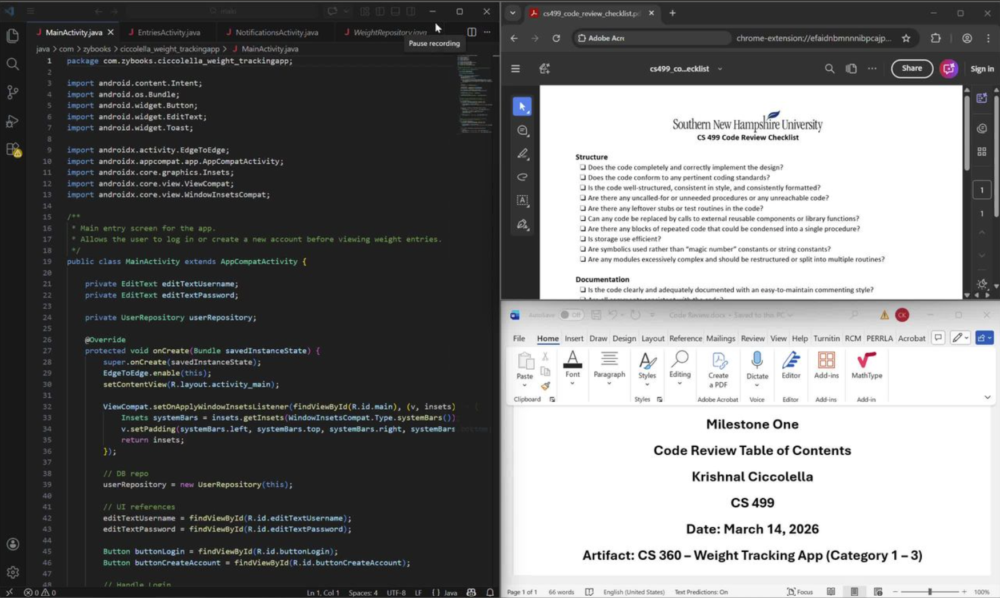
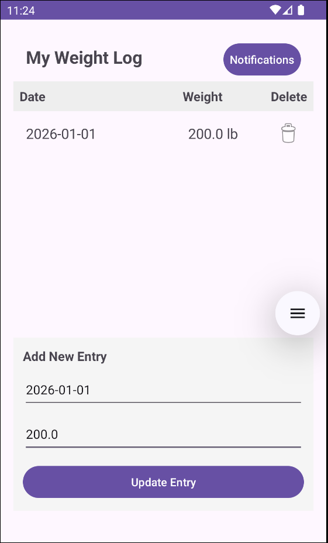
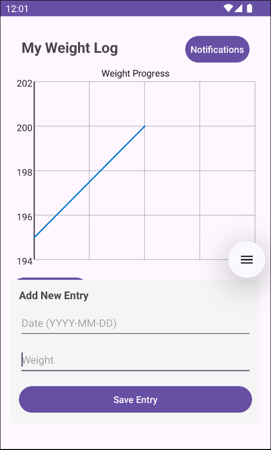
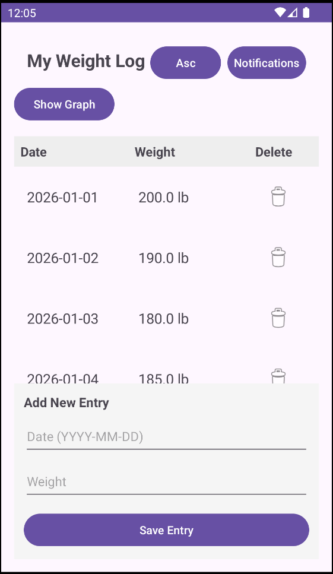
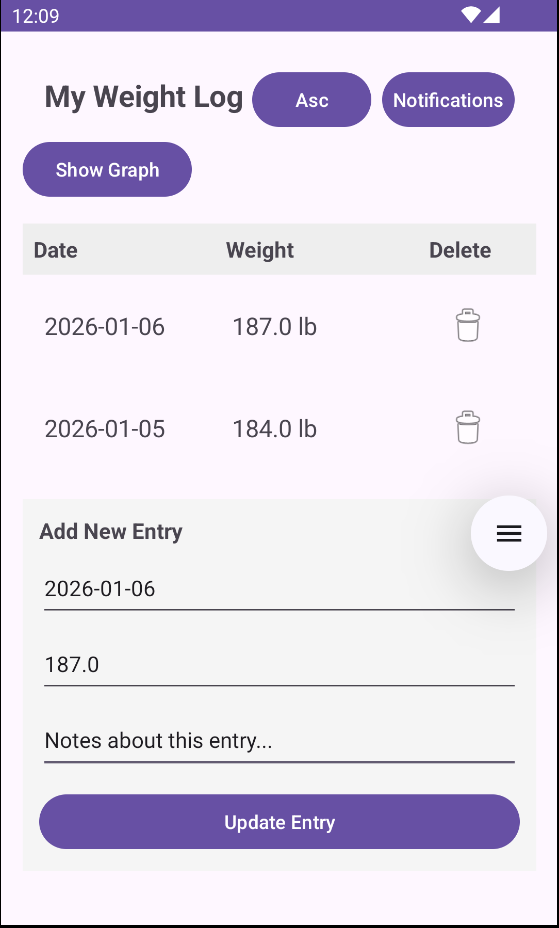

<!-- This is commented out. -->

## ePortfolio

### Introduction

Hello, my name is Krishnal. This page represents my final project and ePortfolio for CS-499 Capstone, marking the completion of my Bachelor’s degree in Computer Science.

### Professional Self-Assessment

Completing the Computer Science program at SNHU has enhanced my technical knowledge and professional skills, providing me with a comprehensive foundation in computer science. As I develop my ePortfolio for the final capstone project, I can see how my coursework has shaped my professional goals and helped me refine the technical expertise I need to pursue a career in the field. This self-assessment will highlight the key skills I’ve developed, with examples from my coursework, to demonstrate how I’m preparing to become a competitive candidate in the job market.

#### Coursework and Program Impact

Throughout my studies, I have engaged deeply with both the theoretical and practical aspects of computer science. The coursework has provided a strong foundation in core topics such as data structures and algorithms, software engineering, and security. A clear example of my ability to implement data structures and algorithms is my work on sorting algorithms for my capstone project, where I explored the most efficient ways to handle large datasets, demonstrating both my technical understanding and problem-solving ability. Additionally, my projects have required careful consideration of system performance, user experience, and effective communication, skills that are essential for any computer scientist.

Completing the ePortfolio has been rewarding as it allowed me to not only demonstrate my technical abilities, but also showcase how my skills have evolved over time. For instance, in the CS 499 capstone, I was able to integrate external libraries, such as GraphView, into my Android Weight Tracking app, improving its usability and visual appeal. This was a significant step in solidifying my software engineering skills and my understanding of UI/UX design. The feedback I’ve received on these projects, has helped me refine my technical writing and documentation skills, ensuring that I can communicate my work effectively.

#### Collaboration and Communication

While my coursework largely did not involve group work or collaboration on projects, effective communication has remained an essential skill throughout my studies. The ability to convey technical concepts clearly has been crucial when presenting my work and receiving feedback. For each project, I focused on explaining my technical choices and design decisions in a way that was accessible, regardless of the audience's background. This approach ensured that my work met the expectations and requirements of the course.

Additionally, communication with instructors played a key role in my learning process, as their feedback helped refine my technical writing, problem-solving skills, and ability to explain complex concepts in a straightforward manner. While I didn’t collaborate in a team environment, I still had ample opportunities to practice communicating and articulating my thoughts on various aspects of software development.

#### Software Engineering, Database, and Security
My coursework has provided me with a solid foundation in software engineering and database management. Through projects like the CS 360 mobile app development course, I was able to implement database solutions using SQLite to store user data securely. In the process, I learned about database normalization, schema design, and CRUD operations, which are essential for building scalable, maintainable applications.

Security has also been a major focus in my coursework, particularly in relation to user authentication and data protection. For instance, in my CS 360 project, I implemented basic authentication protocols to ensure that users' personal data was protected when interacting with the app. This hands-on experience reinforced the importance of secure coding practices and the need for vigilance when handling sensitive user information. I’ve learned to prioritize security throughout the development lifecycle, ensuring that my applications are not only functional but also safe to use.

#### Artifacts and Overall Portfolio

The artifact included in my ePortfolio represents a broad range of skills and experiences that demonstrate my technical proficiency. The Android Weight Tracker app from my CS 360 project is the central artifact in my portfolio, showcasing my skills in mobile development, UI/UX design, and database management. Through this project, I enhanced my software engineering skills by integrating external libraries (such as GraphView) to improve the app's functionality and visual appeal. This artifact highlights my ability to design and build mobile applications while ensuring that they meet both functional and aesthetic standards.

In addition to the mobile development artifact, my work in the Software Design & Engineering enhancement demonstrates my ability to apply external libraries effectively and optimize app performance. I used the integration of GraphView to enhance the user experience by visualizing weight data, showcasing my growing proficiency in leveraging libraries to extend app functionality. This also ties into my Database enhancement, where I implemented SQLite to store user data securely. The database design follows normalization principles and supports CRUD operations, ensuring that the app is scalable and maintainable.

Finally, the Algorithms & Data Structures enhancement is reflected in my work on sorting algorithms for the Weight Tracker app. By researching the most efficient ways to sort weight entries, I developed a deeper understanding of algorithmic efficiency, an essential skill for handling large datasets. These enhancements together showcase my growing expertise in software development, from optimizing app performance to ensuring security and implementing efficient data structures.

The combination of these three enhancements creates a cohesive narrative of my technical abilities, work ethic, and professional growth. The ePortfolio provides potential employers with a comprehensive view of how I've applied the concepts learned throughout the program to real-world projects. It demonstrates my ability to solve complex problems, design functional and secure applications, and continuously refine my skills. This portfolio is a testament to my commitment to producing high-quality work that meets industry standards and my dedication to continual learning and improvement in the field of computer science.

#### Conclusion

Completing the Computer Science program at SNHU, along with developing my ePortfolio, has been a transformative experience. The knowledge and skills I have acquired, along with my ability to communicate technical concepts clearly and collaborate with others, have prepared me to take the next step in my career. My ePortfolio serves as a testament to my competence and employability, demonstrating my readiness to contribute meaningfully in the field of computer science. As I prepare to enter the workforce, I am confident that the experiences and lessons learned throughout this program will continue to guide me toward success in the industry.

### Code Review

    
    
<em>Screenshot of the code review</em>

This is a recording of my selected artifact for the portfolio, the review of the original code and my plan to enhance the code.

You can watch my code review [here](https://www.dropbox.com/scl/fi/zgaulqaqypmhc5r8uf7xv/CS-499-2-2-Code-Review-compressed.mp4?rlkey=1hdj0rptxzfnnlv7iypkmz030&st=k0a6o6b0&dl=0){:target="_blank"}.

### Artifact & Enhancements

#### Artifact - Weight Tracking App

    
    
<em>Screenshot of the artifact</em>

<a href="./ZIP%20Archive/Ciccolella_WeightTrackingApp.zip" download>Click to download</a>

The artifact I selected for my ePortfolio is a Weight Tracking App built using Android Studio with Java, originally developed in CS 360 as part of a mobile app development project and later enhanced during my continued learning in CS 499. The app enables users to input, track, and manage their weight entries over time, featuring full CRUD (Create, Read, Update, Delete) functionality and a goal-weight notification. This artifact demonstrates a wide range of software engineering skills, including mobile development, UI/UX design, data management using SQLite, and the practical application of algorithms and data structures in a real-world context, reflecting both my technical growth and ability to build and refine functional, user-centered applications.

#### Enhancement 1 - Software Design and Engineering

    
    
<em>Screenshot of enhancement 1</em>

<a href="./ZIP%20Archive/Ciccolella_WeightTrackingApp_Enhancement1.zip" download>Click to download</a>

During this enhancement, I focused on several key components:
* Graphing Functionality: I used GraphView to visualize weight progress over time. This not only improved performance but also demonstrated my ability to integrate and optimize external libraries for a better user experience.
* Password Hashing: I implemented bcrypt hashing to securely store user passwords, following best practices in secure coding for mobile applications.
* UI Enhancements (Validation Feedback): I added input validation for the date and weight fields, ensuring users can only enter valid data. Clear, real-time error messages now guide users, improving both usability and data integrity.

These enhancements strengthened the app’s functionality while aligning with best practices in mobile app development and user experience.

The process of enhancing the Weight Tracking App provided valuable learning opportunities. One key lesson was the importance of selecting the right tools for the task. For instance, I initially experimented with MPAndroidChart for graphing, but integration and performance issues led me to adopt GraphView. This experience reinforced how to adapt and choose solutions based on real-world constraints.

Implementing password hashing also presented challenges. While bcrypt simplified secure storage, validating hashed passwords during login required careful handling. This taught me best practices in secure password management and the proper techniques for password verification.

UI validation improvements added another layer of complexity but ultimately created a more robust app. Providing real-time feedback for invalid entries reduced errors and improved the overall user experience.

Through these enhancements, I demonstrated core software engineering skills, including secure password handling, user interface design, and data visualization. Despite the challenges encountered, I successfully delivered solutions that made the app more functional, secure, and user-friendly.

#### Enhancement 2 - Algorithms and Data Structures

    
    
<em>Screenshot of enhancement 2</em>

<a href="./ZIP%20Archive/Ciccolella_WeightTrackingApp_Enhancement2.zip" download>Click to download</a>

The primary enhancement I made to the Weight Tracking App was implementing an efficient sorting algorithm to order weight entries by date, either from oldest to newest or newest to oldest. I selected MergeSort, which has a time complexity of O(n log n), ensuring optimal performance even with larger datasets.

This improvement addressed a performance bottleneck in the original design, where sorting by date could become inefficient as the number of entries grew. By switching from simpler methods like BubbleSort or InsertionSort, which have O(n²) complexity, to MergeSort, the app became significantly more responsive. This decision highlighted my ability to assess algorithmic performance and choose the most suitable solution for the task.

Integrating MergeSort required careful handling of both database retrieval and in-memory data manipulation. Weight entries had to be correctly fetched from the SQLite database and sorted efficiently before display. This process reinforced my understanding of optimizing data handling, balancing both time and space complexity, and integrating backend logic seamlessly with the app’s user interface.

Through this enhancement, I gained valuable lessons in algorithm selection and performance optimization. I learned the importance of matching sorting algorithms to dataset size, ensuring efficient data retrieval, and maintaining app responsiveness. The implementation of MergeSort not only improved functionality but also enhanced the overall usability of the app, directly supporting the course outcomes related to algorithmic optimization and functional mobile app design.

#### Enhancement 3 - Databases

    
    
<em>Screenshot of enhancement 3</em>

<a href="./ZIP%20Archive/Ciccolella_WeightTrackingApp_Enhancement3.zip" download>Click to download</a>

Enhancing the database system to include CRUD operations for user notes was a significant improvement, demonstrating my ability to design and implement relational databases within mobile applications. By enabling the storage of weight entries alongside associated notes, I addressed course outcomes related to database management and relational data handling. Integrating these operations into the app also enhanced its functionality, usability, and overall user experience.

<a href="#top">Back to top of page</a>
